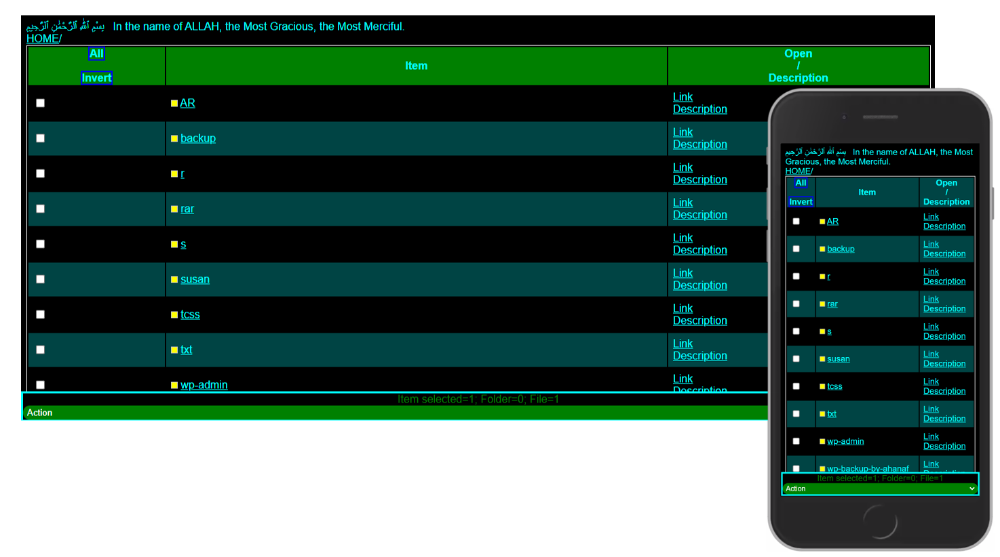

بِسْمِ ٱللَّٰهِ ٱلرَّحْمَٰنِ ٱلرَّحِيمِ   In the name of ALLAH, the Most Gracious, the Most Merciful
# php-file-manager
A simple but powerful php based file manager.

 To do:
* Download <a href="https://rafiz001.github.io/php-file-manager-islamic/f.php">f.php</a>
* Make a password using md5(md5(md5("your password"))) function. Or use <a href="https://rafiz001.github.io/php-file-manager-islamic/md5t.php">md5t.php</a> to get your password.
* Go your text editor for f.php; then set your password at $password variable.
* Now it is ready to go....
* Please make a good DUYA for the developer(Mohammod Rafiz Uddin).

# Current password "ALLAH is my CREATOR" (without qoute)!

# If you face any problem you can send me <a href="mailto:rafiz001@protonmail.ch">e-mail</a>
